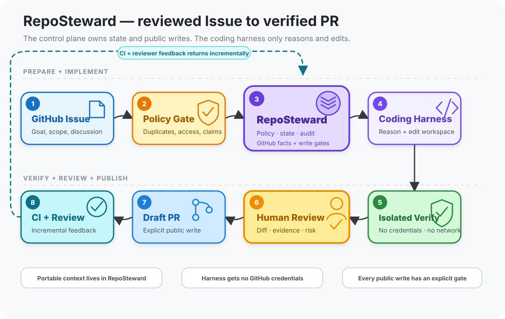

# RepoSteward

> 把 GitHub Issue 变成经过验证和人工确认的 Pull Request。

RepoSteward 是运行在 GitHub 和 Coding Harness 之间的本地维护控制面。它保存 Issue、仓库策略、
执行状态和验证证据，让 Codex 等 Harness 专注于推理和修改工作区。是否创建 Issue、推送分支或
提交 PR，仍由用户通过单独的审核门禁决定。

RepoSteward 适合需要长期维护 GitHub 项目、在多个 Coding Harness 或账号之间切换，又希望保留
统一审阅记录的维护者和贡献者。它不是批量 PR 机器人，也不会让模型直接持有 GitHub 凭据。

<p align="center">
  
</p>

<p align="center"><sub>技术图提供可编辑的 <a href="docs/assets/reposteward-lifecycle.excalidraw">Excalidraw 源文件</a>。</sub></p>

## 一分钟理解

RepoSteward 把一次代码维护任务拆成八个可审计步骤：

1. 从 GitHub Issue 冻结目标、范围和讨论事实；
2. 检查重复项、权限、贡献规则和竞争工作；
3. 由 RepoSteward 保存策略、状态、上下文、审计和 GitHub 写入门禁；
4. 让 Coding Harness 只在隔离 workspace 中推理和编辑，不向它暴露 GitHub 凭据；
5. 在无凭据、无网络的 Runner 中执行允许的验证命令；
6. 由用户审阅最终 diff、验证证据和风险；
7. 通过独立命令显式创建 Draft PR；
8. 增量采集 CI 与 Reviewer 反馈，重新进入同一个受审计流程。

这套路径的重点不是替代 Codex、Claude Code 或其他 Harness，而是让不同 Harness、账号和机器
共享同一份任务事实，同时把公开写入和安全边界留在确定性的控制面中。

## 从这里开始

| 目标 | 建议入口 |
| --- | --- |
| 第一次试用 | [安装](#安装) → [添加项目](#添加项目) → [基本工作流](#基本工作流) |
| 评估产品边界 | [产品边界](#产品边界) → [架构文档](docs/architecture.md) |
| 切换 Harness、账号或机器 | [上下文与跨 Harness 交接](#上下文与跨-harness-交接) |
| 参与开发 | [贡献指南](CONTRIBUTING.md) → [安全报告说明](SECURITY.md) |

## 当前状态

项目仍处于 0.x 早期开发阶段。已经实现的主流程包括：

- 在本地准备 Issue 草稿、搜索重复项，并通过 GitHub Project 审核线上提案；
- 从已有 Issue 创建隔离工作区，调用 Codex CLI 或 Codex SDK 完成修改；
- 在无凭据、无网络的容器中执行允许的验证命令；
- 生成紧凑的 Review Packet，并在人工确认后创建 Draft PR；
- 使用 Context Pack 和 Checkpoint 在账号、机器或 Harness 之间交接任务。
- 只读汇总仓库全部开放 PR，并标出文件重叠、CI、Review 与事实完整性。

Claude Code、DeepSeek 等 Harness 目前只有统一接入契约，尚未提供内置适配器。配置格式和公开
接口在稳定版本发布前仍可能调整。

## 产品边界

| 组件 | 职责 |
| --- | --- |
| RepoSteward | 流水线、仓库策略、持久上下文、审计和 GitHub 事实 |
| Coding Harness | 推理和工作区编辑，不接触 GitHub 凭据 |
| Docker Runner | 安装依赖并执行隔离验证 |
| 用户 | 审阅 Issue、diff 和验证证据，决定是否公开提交 |

Harness 的原生会话只用于加速恢复。版本化 Context Pack 与 Checkpoint 才是任务连续性的记录。
组件设计、持久数据模型和跨账号恢复约束见
[`docs/architecture.md`](docs/architecture.md)。README 顶部流程图描述稳定的产品路径；内部组件和
持久化细节以架构文档为准。

## 安装

要求 Python 3.12+、uv、Git、Docker、GitHub CLI，以及已登录的 Codex CLI。

```bash
git clone https://github.com/tiammomo/RepoSteward.git
cd RepoSteward
uv sync
uv run reposteward --help
uv run reposteward init
```

`init` 默认从当前 `gh auth` 和 Git 全局配置读取登录名、姓名和邮箱，然后将用户配置写入
`~/.config/reposteward/config.toml`。也可以显式提供身份：

```bash
uv run reposteward init \
  --login your-github-login \
  --git-name "Your Name" \
  --git-email your-github-login@users.noreply.github.com
```

配置文件只保存身份声明和运行偏好，不保存 GitHub token。RepoSteward 优先读取当前进程的
`GITHUB_TOKEN` 或 `GH_TOKEN`；未设置时使用 `gh auth token`。新用户默认添加 DCO sign-off，
但不强制 GPG/SSH 签名；需要签名时可在用户配置中设置 `sign_commits = true`。

默认 Harness 是 `codex-cli`。需要使用官方 Python Codex SDK 和可恢复 thread 时，安装可选
依赖并在用户配置中显式选择：

```bash
uv sync --extra codex-sdk
```

```toml
[agent]
harness = "codex-sdk"
```

SDK 适配器不会由项目级 `.reposteward.toml` 静默启用；缺少可选依赖时会明确失败，不会回退到
其他 Harness。

## 添加项目

在需要维护或贡献的项目目录运行：

```bash
uv run reposteward repo add owner/repository
```

维护自己的仓库时使用维护者模式：

```bash
uv run reposteward repo add owner/repository --mode maintainer
```

贡献者模式默认推送到用户 fork；维护者模式默认推送到原仓库的独立分支。提交前会通过 GitHub
API 验证当前身份确实拥有 push 权限，并继续禁止直接使用默认分支。

命令会创建本机专用的 `.reposteward.toml`，并自动加入该仓库的 `.git/info/exclude`，不会修改
仓库受版本控制的 `.gitignore`，也不会让配置混入后续 PR。随后需要填写该仓库允许的安装和验证命令。完整字段可参考
[`reposteward.example.toml`](reposteward.example.toml)，现有复杂仓库适配示例位于
[`examples/tiammomo.toml`](examples/tiammomo.toml)。

配置按以下顺序合并，后者覆盖前者：

```text
内置安全默认值
      ↓
~/.config/reposteward/config.toml
      ↓
项目目录最近的 .reposteward.toml
      ↓
显式命令参数
```

旧的 `starfix.toml` 仍可被发现，缺少 `config_version` 的旧配置按版本 1 兼容读取。新配置
默认把数据库和运行日志隔离到 `~/.local/state/reposteward/<GitHub host>/<login>/`，把临时克隆隔离到
`~/.local/share/reposteward/workspaces/<GitHub host>/<login>/`；支持 XDG 目录变量，Windows 使用
`LOCALAPPDATA`。这样不会在被维护的仓库中产生运行文件，也避免切换 GitHub 用户时混用记录。
旧配置显式指定 `state_dir` 时保持原有工作区布局。项目层不能覆盖用户层的运行目录、GitHub 身份、Agent executable 或 Runner
image；项目安全设置只能收紧用户限额和默认禁止路径，不能静默放宽它们。

## 准备 Issue 草稿

RepoSteward 可以在本地生成结构化 Markdown，并只读搜索相似 Issue：

```bash
uv run reposteward issue draft owner/repository \
  --title "Watcher 单轮重复读取同一轨迹" \
  --summary "轨迹数量较多时，单轮轮询会重复执行相同读取。" \
  --actual "每个 Atom 都重新读取完整轨迹。" \
  --expected "每条轨迹在单轮中最多读取一次。" \
  --reproduction "启动 watcher，并让一条轨迹包含多个 Atom。" \
  --acceptance "同一轨迹单轮只读取一次" \
  --language zh

uv run reposteward issue list
uv run reposteward issue inspect DRAFT_ID
uv run reposteward issue duplicate-check DRAFT_ID
```

草稿保存在当前用户和项目隔离的本地数据库中。`duplicate-check` 只调用 GitHub 搜索接口，
不会创建或修改 Issue。多人协作时，可以把草稿暂存为团队 GitHub Project 中的 Draft Issue：

```bash
REPOSTEWARD_ENABLE_ISSUE_STAGE=1 \
  uv run reposteward issue stage DRAFT_ID --submitted-by your-github-login
```

Project Draft Issue 是线上共享提案，不会出现在目标仓库的正式 Issue 列表。团队可以在线修改正文；
review 命令始终重新读取线上最新版本，并同时生成重复项快照、安全扫描结果和内容摘要：

```bash
uv run reposteward issue review PROJECT_ITEM_ID_OR_URL \
  --repository owner/repository
```

另一位 reviewer 检查 Project 正文和所有潜在重复项后，使用该次 review 返回的精确摘要进行转换：

```bash
REPOSTEWARD_ENABLE_ISSUE_PROMOTION=1 \
  uv run reposteward issue promote PROJECT_ITEM_ID_OR_URL \
  --repository owner/repository \
  --reviewed-by reviewer-login \
  --review-digest REVIEW_DIGEST \
  --duplicates-reviewed
```

线上正文、Project、重复项结果或目标仓库发生变化时，旧摘要失效，必须重新 review。默认禁止提案
创建者自行转换；检测到凭据或疑似安全漏洞时，暂存和转换都会失败，必须改用私有报告渠道。
GitHub Actions 的人工审查与转换流程见 [`docs/github-actions.md`](docs/github-actions.md)。
Project 页面 URL 里的数字 `itemId` 也可直接使用，因此不经本地 `stage` 而在线创建的提案同样可审核。

## 基本工作流

构建验证镜像并检查本地环境：

```bash
uv run reposteward image build
uv run reposteward doctor
```

发现和查看候选：

```bash
uv run reposteward discover
uv run reposteward discover --repo owner/repository
uv run reposteward list --all
```

检查贡献门禁并准备修复：

```bash
uv run reposteward gate owner/repository 123
uv run reposteward prepare owner/repository 123
```

`prepare` 会 clone 最新默认分支、运行 Codex、执行 allowlist 中的验证命令、检查 diff，并创建
本地 commit。Codex 和测试进程都拿不到 GitHub 凭据；验证阶段的容器没有网络、宿主目录或
Docker socket。

如果改动已经在外部工作区完成，可以使用 `adopt` 将现有 commit 纳入同一验证与审阅流程。

## PR 组合快照

在同时维护多个 PR 时，可以先生成仓库级只读快照：

```bash
uv run reposteward portfolio inspect owner/repository --format text
uv run reposteward portfolio inspect owner/repository --format json
```

命令会完整分页读取全部开放 PR，再汇总每个 PR 的 head/base、Draft 状态、changed files、diff
规模、required checks、Review decision 和未解决会话。文件重叠通过倒排索引构建，不会逐对重新扫描
所有 changed files。任何权限不足、分页不完整或采集期间的状态变化都会把快照标记为不完整，并在
结果中保留对应 PR 和错误原因。

每个快照都有基于规范化事实生成的稳定 SHA-256。需要在后续动作前检查事实是否仍未变化时，可传入
上一次摘要：

```bash
uv run reposteward portfolio inspect owner/repository \
  --expected-digest SNAPSHOT_DIGEST \
  --format text
```

该命令不调用 Harness、不修改 workspace、不持久化快照，也不执行任何 GitHub 写操作。JSON 适合
自动化消费，文本输出只展示紧凑的人类审阅摘要。

需要表达权威依赖时，在 PR 正文中使用独立行；引用、代码块或普通句子中的相似文字不会生效：

```text
Depends on #123
```

生成依赖图、循环检测和确定性建议顺序：

```bash
uv run reposteward portfolio plan owner/repository --format text
```

PR 正文的显式声明和维护者确认属于权威边；changed-file 重叠只显示为无方向建议，不能单独阻止
Ready 或 merge。缺失、跨仓库、未合并或循环依赖会进入 `ready_blockers`；已经合并的前置 PR 会进入
`revalidation_recommended`，提示重新核验 base 和验证证据。`merge-decision` 同样读取当前 PR 的直接
依赖，未满足或无法完整确认时失败关闭。

正文声明绑定当前 head、PR 作者和稳定来源摘要，编辑历史仍由 GitHub 保存；`portfolio plan` 不把
外部正文复制到本地数据库，因此保持只读。只有维护者 confirm/revoke 会写入本地追加审计表。

当依赖不是由 PR 作者写入正文时，维护者可以追加一条只保存在本机审计数据库、并绑定当前 head 的
确认；撤销会追加新事件，不覆盖历史：

```bash
REPOSTEWARD_ENABLE_DEPENDENCY_ATTESTATION=1 \
  uv run reposteward portfolio dependency confirm owner/repository 124 123 \
  --reviewed-by your-github-login

REPOSTEWARD_ENABLE_DEPENDENCY_ATTESTATION=1 \
  uv run reposteward portfolio dependency revoke owner/repository 124 123 \
  --reviewed-by your-github-login

uv run reposteward portfolio dependency list owner/repository --pull-number 124
```

该操作要求 Maintainer same-repository 配置，并同时核对配置身份、GitHub token 身份和仓库 push 权限；
它不会修改 GitHub。PR head 改变后，旧确认自动失效并成为显式 blocker，必须重新确认或撤销。

## 审阅与日志

`prepare` 和 `adopt` 返回紧凑 Review Packet，其中包括 commit SHA、diffstat、风险、验证
状态、日志路径和 Agent token 使用量，不会默认携带完整测试输出。

```bash
uv run reposteward inspect RUN_ID
uv run reposteward logs RUN_ID
uv run reposteward logs RUN_ID --command 1 --tail-chars 12000
```

验证日志默认保存在用户状态目录的 `runs/RUN_ID/verification/`。通过命令在数据库中保留最后
2,000 个字符，失败命令保留最后 12,000 个字符；更完整的日志文件有 2,000,000 字符上限，
并记录原始长度和 SHA-256。

RepoSteward 会从 Codex CLI JSONL 或 Codex SDK turn result 中提取输入、缓存输入、输出和推理
token，并记录工具调用次数；CLI 适配器还记录事件流大小。资源预算告警会出现在 Review Packet
中，但不会绕过验证。

## 上下文与跨 Harness 交接

每次 `prepare` 或 `adopt` 都会创建一个持久 work item，并保存：

- 版本化 Context Pack：Issue 目标、基础 commit、仓库策略摘要、指导文件指纹和信任来源；
- Checkpoint：当前 HEAD、已完成工作、技术决定、验证证据、风险和精确下一步；
- Harness run：本次使用的 harness、模型和可选原生 session ID。

查看或导出可移植上下文：

```bash
uv run reposteward context inspect RUN_ID
uv run reposteward context export RUN_ID --output handoff.json
uv run reposteward context import handoff.json
```

导出文件包含内容摘要和估算 token 数，不包含账号凭据。更换 Codex 账号、机器或 Coding
Harness 时，应从该文件重建上下文；即使原生 session 无法恢复，任务事实和验证证据也不会
丢失。当前内置实现包括默认的 `codex-cli` 和显式可选的 `codex-sdk`，Claude Code 和 DeepSeek
等实现可以通过统一 Harness 契约接入，无需修改 Pipeline。`codex-sdk` 会尝试恢复同一原生
thread；恢复失败时从 Context Pack 开启新 thread。同一个 work item 再次运行时，RepoSteward
会把最近的 Checkpoint 压缩进新的 Context Pack，并要求 Harness 对历史结论重新核验。

Context Pack、Checkpoint 和导出包采用 Draft 2020-12 JSON Schema，并在写入或导入时严格
校验未知字段、版本、关联身份、摘要和大小。导入操作幂等；如果本机已有更新过的 work item，
交接包只补充历史 Checkpoint，不覆盖本机的 Issue 快照。`bundle_digest` 用于发现传输损坏，
不代表签名或来源认证，因此导入内容仍按不可信输入处理。

## 项目级 Skills

RepoSteward 使用 `.agents/skills/<name>/SKILL.md` 保存可跨 Coding Harness 复用的维护流程。本仓库
提供的 `reposteward-maintainer` skill 覆盖 Issue 审核、聚焦 PR、CI/Reviewer 跟进和上下文交接；
状态机、凭据隔离、内容摘要、验证与 GitHub 公开写入仍由代码强制执行，不下放给提示词。

Context Pack 只记录最多 8 个项目 skill 的路径和 SHA-256 指纹，不复制完整正文。Harness 在确有
需要时从工作区读取对应 skill，因此切换 Codex、Claude Code 或 DeepSeek 等实现时可以共享流程，
又不会让每次调用承担全部 skill 的上下文成本。仓库 skill 与其他仓库文本一样按不可信输入处理，
不能放宽凭据、网络或公开写入边界。

## 提交与跟进

公开提交必须使用独立命令，并同时满足环境开关、GitHub 实际身份和人工审阅声明：

```bash
REPOSTEWARD_ENABLE_SUBMIT=1 \
  uv run reposteward submit owner/repository 123 \
  --reviewed-by your-github-login
```

默认创建 Draft PR。`--reviewed-by` 必须等于用户配置中的 GitHub login，API token 的实际登录
身份也必须一致。旧的 `STARFIX_ENABLE_SUBMIT=1` 暂时保留兼容读取。

提交后可以增量查看变化：

```bash
uv run reposteward follow-up RUN_ID
uv run reposteward repair RUN_ID
uv run reposteward merge-decision RUN_ID
```

第一次调用会把 PR、评论、Review、Review comment 和 checks 按稳定 ID 与内容版本写入事件表，
建立 run 水位并追加 Review Checkpoint；之后只返回水位后的新增或编辑版本。REST 分页会完整读取，
不再把每类前 100 条当成完整历史。GitHub 结构化事件是跟进事实，模型摘要只是可重建的派生信息；
评论和 Review 正文始终视为不可信数据，不会被自动执行。重复调用是幂等的，事件摄取与水位推进
分离，进程在生成 Checkpoint 前中断时不会丢失待处理事件。

Contributor fork 收到新的失败 check、Reviewer 正文或 diff 内行级评论后，可以对最近一次
`submitted` run 执行 `repair`。命令先按水位读取增量并做确定性范围判断：没有新增可执行信息、
只有成功 check，或只有指向当前 diff 之外路径的建议时不会调用 Harness。确需理解代码时，Harness
只收到统一 token 预算内的事件批次、相关 diff 片段和紧凑 Checkpoint，在原 worktree 修改；Runner 重新验证后生成新的本地 `ready`
commit。更新已有 PR 仍必须再次执行带 `--reviewed-by` 的 `submit`。准备后若 head、base、策略或
事件水位变化，旧修复会被拒绝。该流程不会自动回复、催促 Reviewer 或合并 upstream PR。

预算由用户配置中的 `[context].follow_up_max_tokens` 控制，默认 24,000。估算直接使用 UTF-8 字节数作为供应商无关的保守上界，
计算，不依赖模型供应商或原生会话；稳定 ID 只保留最新事件版本，相同内容摘要只注入一次。输出的
`context_plan.stats` 会记录预算前事件数、保留数量以及版本替换、内容重复、字段裁剪、预算裁剪和
diff 不可用等原因。安全阻塞、当前 head/base、失败 check 和阻塞 Review 属于强制事实；如果它们
与紧凑 Checkpoint 本身都无法放入预算，命令会明确失败，不会静默删除后继续调用 Harness。
Repair 在调用 Harness 前会渲染完整 Prompt，并把 Issue 正文、固定提示、指导路径、Context Pack
分片、增量事件、diff 片段和紧凑 Checkpoint 一并纳入同一预算。长 Issue 正文只在 Repair 输入中按
UTF-8 字节安全截断，初次 `prepare` 语义不变；若仍超限，会先移除可选 diff 和低优先级反馈，但
始终保留安全事实及至少一条可执行反馈。最终估算和裁剪数量记录在 `context_budget` 与
`context_plan.stats.final_prompt_budget` 中，无法容纳最小必要集合时明确失败。

失败 check 可以先用确定性 CI 诊断读取，而不立即把日志发送给 Harness 或盲目重跑：

```bash
uv run reposteward ci diagnose owner/repository 123
```

该命令完整分页读取目标 workflow run 的 job/step 元数据，只对当前失败 job 及同 job/platform 的
有限失败对照下载日志。当前失败日志和对照日志分别最多读取 24 个；下载使用不携带 GitHub
Authorization 的短期签名 URL 和 256 KiB Range 上限；日志先脱敏，
再提取最多 12 条错误片段生成稳定指纹，完整原始日志不会进入输出或本地数据库。比较范围固定为
同一 workflow run 的其他 attempt、同 PR 最近 12 个 run，以及当前 base SHA 最近 12 个 push run。
结果只在证据充分时标记 `introduced`、`inherited`、`flaky` 或 `infrastructure`；第三方 check、
日志不可读、比较不完整或矛盾时返回 `unknown`。命令不调用 Harness、不修改 PR，也不触发 rerun。

`merge-decision` 只读获取完整的 changed files、required checks、Review decision 和未解决会话，
再对照验证时冻结的 head、base、policy digest、规模上限及高风险路径生成确定性结果。每次调用都会
追加一条本地审计记录，但不会调用 Harness、修改 workspace 或执行 GitHub 写操作。内置 CI、权限、
Runner、数据库、依赖发布和安全风险规则不能被项目配置削弱；项目只能通过 `merge_risk_paths` 追加
需要人工合并的路径。

Maintainer 可以为单个仓库显式启用合并执行器；默认仍关闭：

```toml
[repositories."owner/repository"]
mode = "maintainer"
submission_strategy = "same-repository"
auto_merge = true
auto_merge_method = "squash"
```

执行器只消费一次指定的 eligible 决策，不会自己生成资格。先运行 `merge-decision`，人工检查返回的
决策和 `audit.id`，再显式执行：

```bash
REPOSTEWARD_ENABLE_MERGE=1 \
  uv run reposteward merge RUN_ID \
  --decision-id MERGE_DECISION_AUDIT_ID \
  --reviewed-by your-github-login
```

命令会核对配置身份、token 实际身份和仓库 push 权限，并在写入前两次读取完整 PR 活动与合并快照。
任何评论或 Review 编辑、check、会话、head/base、策略、规模或风险变化都会使旧决策失效；请求还会
绑定精确 head SHA。网络结果不确定时先回读 GitHub，已在相同 head 合并则作为幂等成功，否则失败
关闭。每次尝试的意图和结果都追加到本地审计。Contributor mode、高风险路径、超限 PR、后台轮询、
Reviewer 回复和自动开启 GitHub auto-merge 均不在该执行器范围内。

本地占用可以按仓库、数据类别和时间范围只读查看：

```bash
uv run reposteward storage stats
uv run reposteward storage stats --repo owner/repository --since-days 30
```

输出分别给出逻辑载荷字节、验证日志缓存和 SQLite/WAL/SHM 的实际文件字节；跨仓库共享的内容
寻址 Blob 会在各仓库行中显示引用字节，并在说明字段中明确其可能重复计算，避免把逻辑引用误当成
全局物理占用。

清理命令默认只生成精确计划，不写数据库或删除文件：

```bash
uv run reposteward storage gc --repo owner/repository
```

默认候选只有超过用户级 `cache_retention_days` 且已有终态 Checkpoint 的验证日志。原始 GitHub
事件正文没有默认期限；只有仓库显式配置 `event_payload_retention_days` 后，超过期限且每个 run 水位
都已覆盖的正文才进入候选。计划会列出每个候选、预计可回收字节及保留原因汇总，并始终保护事件
索引、Checkpoint、Merge Decision、Merge Execution 和 GC 审计。

实际应用需要命令参数和独立环境开关同时存在：

```bash
REPOSTEWARD_ENABLE_GC=1 uv run reposteward storage gc \
  --repo owner/repository --apply
```

apply 前会追加 `applying` 审计，删除后再追加 `completed` 审计；中断后可从未完成记录识别并安全
重跑。SQLite Blob 删除释放的是可复用数据库页，不会自动执行 `VACUUM` 或承诺立即缩小数据库文件。

## 安全约束

- GitHub 凭据不会传给 Agent、测试、仓库 hooks、Git push 或 Docker 容器。
- Issue、仓库内容、评论和 Review 正文都视为不可信输入。
- CI 日志先限长和脱敏，只保存或输出可解释的有界片段与摘要。
- 安全报告、已认领 Issue、竞争 PR 和仓库贡献门禁可以阻断流水线。
- `.github/workflows`、凭据路径和超出配置限额的 diff 默认不可提交。
- 依赖安装可以在无凭据容器中联网，实际验证命令在 `--network none` 下运行。
- `run` 最多自动准备候选，永远不会自动执行 `submit`。

## 参与开发

功能、性能和行为变更应先通过 Issue 明确问题、证据和验收标准，再以聚焦 PR 落地。开始前请
阅读 [`CONTRIBUTING.md`](CONTRIBUTING.md)。安全问题请按 [`SECURITY.md`](SECURITY.md) 私下报告，
不要创建公开 Issue。

## 名称迁移

项目原名为 Starfix。由于 PyPI 已存在活跃的 `starfix` 包，且 GitHub 上已有同名开发工具，
公开产品改名为 RepoSteward：Python distribution 和 CLI 均使用 `reposteward`，建议 GitHub
仓库使用 `repo-steward`。旧状态目录和 `starfix.sqlite3` 数据库仍会被兼容读取。
